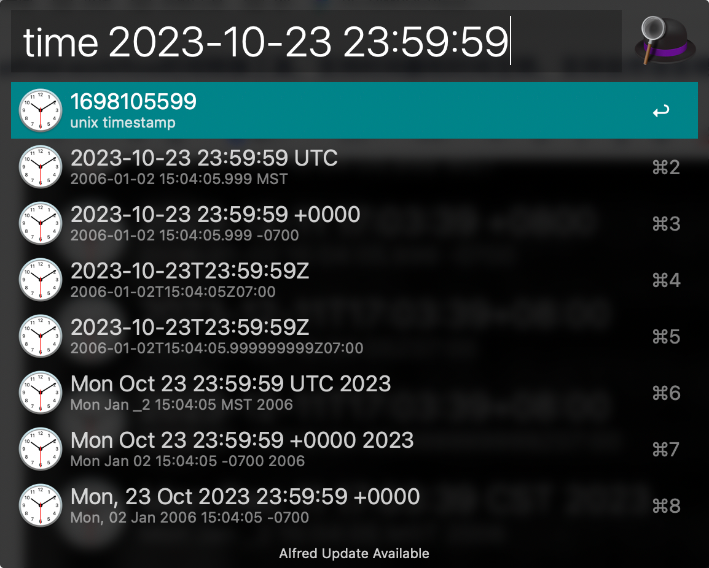

# 时间转换工具 Workflow 指南

该workflow主要是为了对 **时间戳**、**格式化日期+时间字符串** 和 **自然语言格式** 进行快速转换，它包括了对中文月份和不同日期格式的支持，方便使用。开发人员，经常会涉及到时间相关的转换操作，有个好用的工具还是能提高不少效率的。原先在网上找了个已有的实现，但是用着不方便，也不够灵活，干脆自己造一个轮子算了。

## 如何使用？

### 1. 运行
使用 `time` 唤起workflow。

### 2. 获取当前时间对应的Unix时间戳，以及格式化字符串
输入 `time now`，将当前时间转换为时间戳以及格式化后的字符串（多种日期格式）。

### 3. 将时间戳转换为对应的格式化字符串
以时间戳 `1701680380` 为例，
输入 `time 1701680380`，此时会将时间戳转换为格式化后的字符串。选择、复制数据操作类似。

### 4. 将格式化字符串转换为时间戳，或其他格式
例如，对于字符串 `2023-10-04`，
输入 `date 2023-10-04`，此时会先将其与候选的格式化字符串进行匹配。并转换成一个有效的时间戳。然后再根据此时间戳，转换为其他格式对应的字符串。选择、复制数据操作类似。

### 5. 更多示例：将自然语言转换为时间戳，或其他格式
例如，对于字符串 “一月” 与 “January”，
输入 `time 一月`，此时会先将其与候选的格式化字符串进行匹配。并转换成一个有效的时间戳。然后再根据此时间戳，转换为其他格式对应的字符串。选择、复制数据操作类似。

#### 开源地址：[https://github.com/aa12gq/datetime-alfredworkflow](https://github.com/aa12gq/datetime-alfredworkflow)